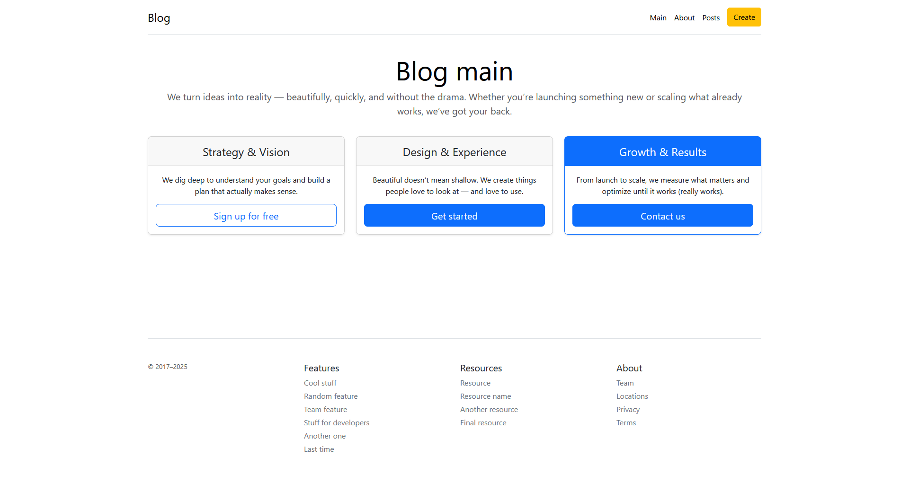
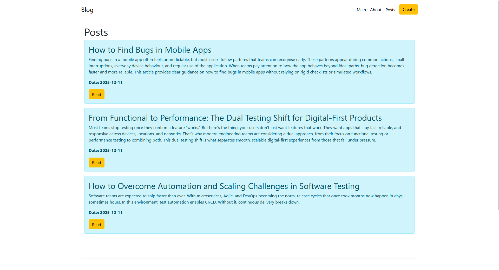
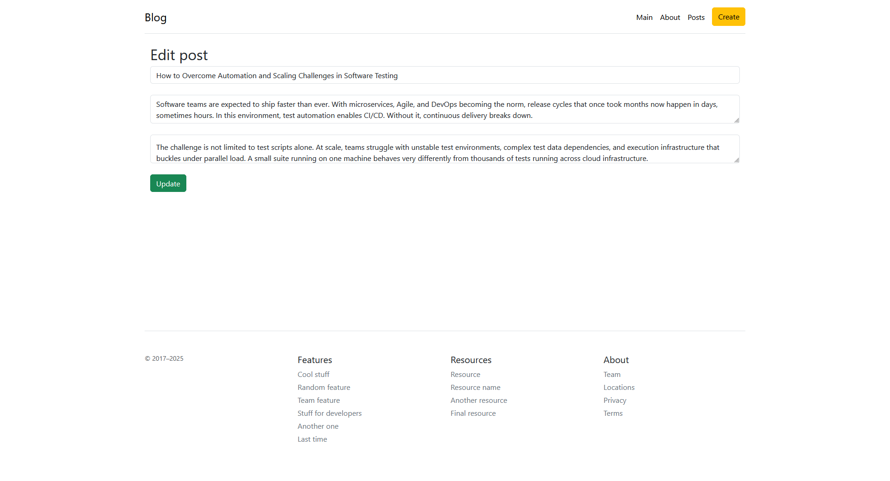

# Flask Starter


*Main page*


*Posts page*


*Edit post function*

## Getting Started

Install the required dependencies:

```bash
python -m venv .venv
source .venv/bin/activate
pip install .
```

Or, if using [uv](https://docs.astral.sh/uv/):

```bash
uv sync
```

## Running Locally

Start the development server on http://0.0.0.0:5001

```bash
python main.py
# using uv:
uv run main.py
```

When you make changes to your project, the server will automatically reload.
